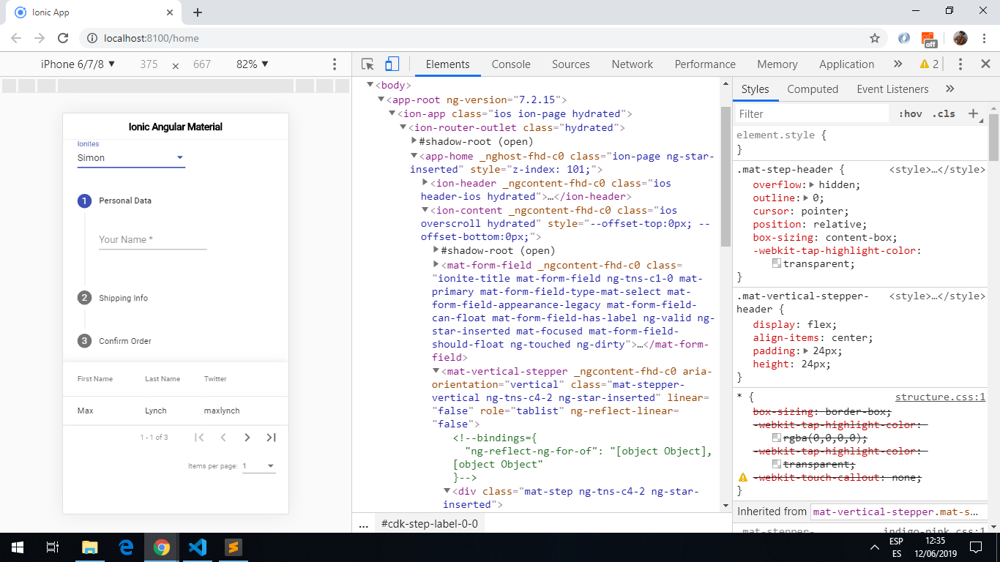

# Ionic Angular Material

App created using the [Ionic 5 framework](https://ionicframework.com/docs) to use [mat select](https://material.angular.io/components/select/overview) to select from a list of options, [mat paginator](https://material.angular.io/components/paginator/overview) to navigate pages and [Material Stepper](https://material.angular.io/components/stepper/overview) to divide content into logical steps.

## Table of contents

* [General info](#general-info)
* [Screenshots](#screenshots)
* [Technologies](#technologies)
* [Setup](#setup)
* [Features](#features)
* [Status](#status)
* [Inspiration](#inspiration)
* [Contact](#contact)

## General info

* Angular Material is the implementation of Material Design for Angular. It offers a wide range of components and patterns for navigation, forms, buttons, layouts etc. The latest version is 8.0.0 but version 7.3.7 is used here with Ionic.

## Screenshots



## Technologies

* [Ionic v5.0.0](https://ionicframework.com/)

* [Angular v7.2.2](https://angular.io/)

* [Ionic/angular v4.1.0](https://www.npmjs.com/package/@ionic/angular)

* [Angular Material v7.3.7](https://material.angular.io/)

## Setup

* To start the server on _localhost://8100_ type: 'ionic serve'

## Code Examples

* extract from `home.page.html` of the material table that displays the user first name using data-interpolation.

```html
  <ng-container matColumnDef="first_name">
    <th mat-header-cell *matHeaderCellDef> First Name </th>
    <td mat-cell *matCellDef="let user"> {{user.first_name}} </td>
  </ng-container>
```

## Features

* User list can be extended. Lots of additional material components can be added.

## Status & To-do list

* Status: Working.

* To-do: try more of the functionality from Angular Material.

## Inspiration

Project inspired by [Simon Grimm´s Youtube video: ionic angular material](https://www.youtube.com/watch?v=pd-CF-dWEak)

## Contact

Repo created by [ABateman](https://www.andrewbateman.org) - feel free to contact me!
